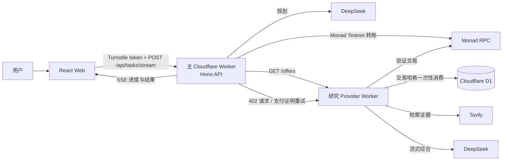
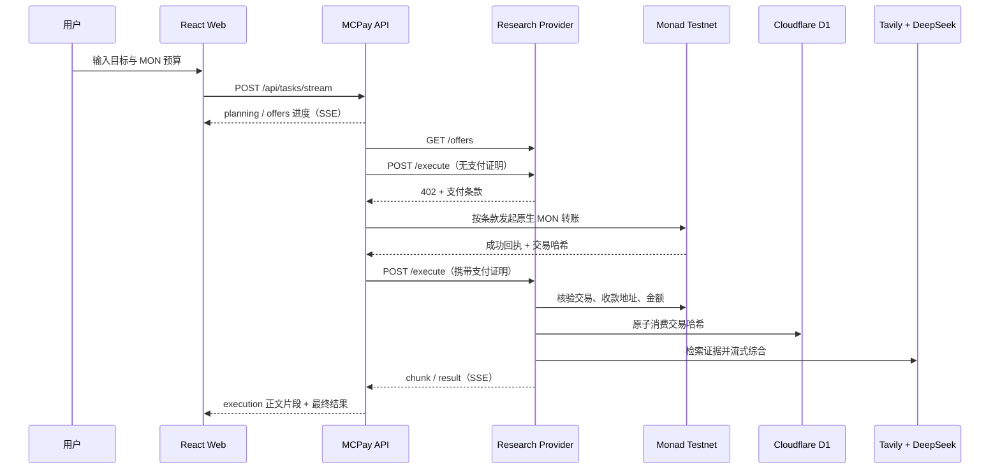

# MCPay 系统架构与数据流

## 组件图



## 主执行序列



## API 契约

### MCPay API

| 方法与路由 | 作用 | 响应 |
| --- | --- | --- |
| `POST /api/tasks` | 非流式创建任务 | 完整任务 JSON |
| `POST /api/tasks/stream` | 创建任务并观察执行过程 | SSE：`progress`、`result`、`error` |

请求体：

```json
{ "goal": "Research the Monad ecosystem", "budgetMon": "0.01" }
```

进度事件：

```text
event: progress
data: {"stage":"planning","message":"Planning Task and discovering Offers"}
```

### Provider API

| 方法与路由 | 作用 |
| --- | --- |
| `GET /health` | 健康检查 |
| `GET /offers` | 返回当前的 `web-research` Offer |
| `POST /execute` | 无支付证明时返回 `402`；验证并消费证明后执行研究 |

Provider 的支付证明请求头：

```text
x-payment-tx: 0x<64 hex>
x-payment-recipient: 0x<40 hex>
x-payment-amount: <MON atomic units>
```

若客户端请求头 `Accept` 包含 `text/event-stream`，Provider 返回 SSE 的 `chunk`、`result`、`error` 事件，而不是一次性 JSON。浏览器使用 `fetch` 读取 SSE 响应，因为任务创建需要 `POST` 与 Turnstile 请求头；`EventSource` 仅支持 GET，不能满足这个请求契约。

## 部署边界

| Worker | 责任 | 持久状态 |
| --- | --- | --- |
| `mcpay` | 静态 Web、任务编排、钱包支付、Turnstile 验证 | 无应用数据库 |
| `mcpay-research-provider` | Offer、402、链上验证、研究执行 | D1 的 `payment_consumptions` |

主 Worker 的自定义域名配置为 `mcpay.yonjay.me`；Provider 使用其 `workers.dev` URL 供主 Worker 调用。部署参数与密钥名称见根目录 README。
